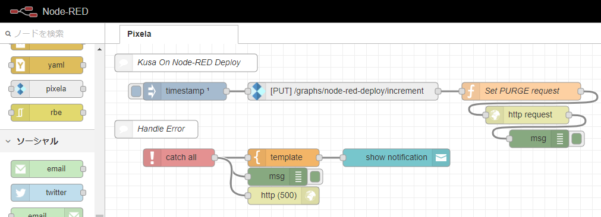

# Ansible KUSANAGI Node-RED

This playbook is my [Node-RED](https://nodered.org/) on [KUSANAGI](https://kusanagi.tokyo/).

My Node-RED: https://node-red.7474.jp:8443/



## Play snipet

```sh
ansible-playbook -i 'myhost,' site.yml --extra-vars="@myvar.yml"
```
